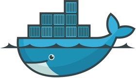

# Docker 101

### Getting started with Docker

---

## Objectives

@ul
- Find out why Docker is awesome
- Understand how virtual machines and Docker differ
- Install Docker on our computer
- Understand Docker's core concepts
- Run our first container
- Get a little fancy with interactive terminals
- Explore
@ulend

---

## Why Docker is Awesome

Docker is an OS-level virtualization platform that allows for the isolation of applications and the sharing of selected resources.

@ul
- **SPEED** (no OS means super-fast startup)
- **PORTABILITY** (easy to move things around)
- **EFFICIENCY** (much smaller overhead)
@ulend

---

## Virtual Machines vs Docker


---

## Installation

https://store.docker.com

### Supported Platforms

- MacOS (High Sierra and up)
- Linux (kernel version 3.10 and up)
- Windows 10 and Windows Server 2016

---

## Concepts

@ul
- Docker Engine
- Images
- Dockerfiles
- Containers
- Image Registries
@ulend

---

## Hello World!

```shell
$ docker container run hello-world
Unable to find image 'hello-world:latest' locally
latest: Pulling from library/hello-world
9bb5a5d4561a: Pull complete
Digest: sha256:f5233545e43561214ca4891fd1157e1c3c563316ed8e237750d59bde73361e77
Status: Downloaded newer image for hello-world:latest

Hello from Docker!
This message shows that your installation appears to be working correctly.

To generate this message, Docker took the following steps:
 1. The Docker client contacted the Docker daemon.
 2. The Docker daemon pulled the "hello-world" image from the Docker Hub.
    (amd64)
 3. The Docker daemon created a new container from that image which runs the
    executable that produces the output you are currently reading.
 4. The Docker daemon streamed that output to the Docker client, which sent it
    to your terminal.

To try something more ambitious, you can run an Ubuntu container with:
 $ docker run -it ubuntu bash
```

@[1](The command)
@[8-9](Why, hello there!)
@[11-12](Step 1)
@[2]
@[11, 13-14](Step 2)
@[3-6]
@[11, 15-16](Step 3)
@[11, 17-18](Step 4)
@[20-21](Something more ambitious)

---

## The Docker Engine

The Docker Engine is a platform composed of:

@ul
- The `dockerd` daemon
- The REST API that allows programs to talk to the daemon
- The `docker` CLI
@ulend

---

## `docker info`

```shell
$ docker info
Containers: 2
 Running: 1
 Paused: 0
 Stopped: 1
Images: 2
Server Version: 18.03.1-ce
(...)
```

@[1](Command)
@[6](Images)
@[2-5](Containers)
@[7](Server Version)

---

## Images

Docker images are:

@ul
- Read-only templates with instructions for how to create a container
- Frequently based on other images
- Full of instructions that result in a layer in the image
@ulend

---

## Containers

Docker containers are:

@ul
- Runnable instances of an image
- Something you can start, stop, move, and delete
- Something you can attach to networks
- Something you can attach storage to
- Isolated from other containers and the host
@ulend

---

## `docker run -it`

```shell
$ docker run -it --rm busybox
Unable to find image 'busybox:latest' locally
latest: Pulling from library/busybox
07a152489297: Pull complete
Digest: sha256:141c253bc4c3fd0a201d32dc1f493bcf3fff003b6df416dea4f41046e0f37d47
Status: Downloaded newer image for busybox:latest
/ # ls
bin   dev   etc   home  proc  root  sys   tmp   usr   var
/ # echo $HOSTNAME
af3e3464c48d
```

@[1](Command)
@[2-6](Pulling the Image)
@[7-8](It Has a File System!)
@[9-10](It Has a Host Name!)

@ul
- Interactive Terminal
- Clean up on exit
- Detached vs foreground

---

## Image Registries

Docker image registries:

@ul
- Store Docker images
- Docker Hub (by default)
- Private if necessary
- Modeled heavily after GitHub (and similar)
@ulend

---

## Dockerfiles

Dockerfiles are text files with instructions on how to build an image.

```shell
FROM nginx

COPY wrapper.sh /

RUN chmod +x ./wrapper.sh

COPY html /usr/share/nginx/html

CMD ["./wrapper.sh"]
```

@[1](Declare a base image)
@[3](Copy a file into the file system)
@[5](Run a command)
@[7](Copy more files into the file system)

---

## `docker build`

```shell
$ docker build -f Dockerfile .
Sending build context to Docker daemon  39.94kB
Step 1/4 : FROM nginx
latest: Pulling from library/nginx
f2aa67a397c4: Pull complete
1cd0975d4f45: Pull complete
72fd2d3be09a: Pull complete
Digest: sha256:3e2ffcf0edca2a4e9b24ca442d227baea7b7f0e33ad654ef1eb806fbd9bedcf0
Status: Downloaded newer image for nginx:latest
 ---> cd5239a0906a
Step 2/4 : COPY wrapper.sh /
 ---> 1be13b6138d1
Step 3/4 : COPY html /usr/share/nginx/html
 ---> 78b5fd09218b
Step 4/4 : CMD ["./wrapper.sh"]
 ---> Running in d2348d60933a
Removing intermediate container d2348d60933a
 ---> 4c05e799cbf6
Successfully built 4c05e799cbf6
```

@[1](Command)
@[3-8](Pulling the base image)
@[11, 13, 15](Running the instructions)
@[19](Voila!)

---

## `docker run -d -P --name`

```shell
$ docker run -d -P --name static-site  ad93ee7a4fc8
4a651d41903a503903ca8e01f287f87e4cb5bad2190ee946cb0a06d8fa721f7b
```

@[1](Command)
@[2](Container Id)

@ul
- Detached mode
- Publish all exposed ports
- Name the container
@ulend

---

## `docker ps`

```shell
$ docker ps
CONTAINER ID        IMAGE                        COMMAND                  CREATED             STATUS              PORTS                    NAMES
4a651d41903a        ad93ee7a4fc8                 "./wrapper.sh"           2 minutes ago       Up 2 minutes        0.0.0.0:32768->80/tcp    static-site
```

@[1](Command)
@[2-3](Container Info)

---

## `docker port`

```shell
$ docker port static-site
80/tcp -> 0.0.0.0:32768
```

@[1](Command)
@[2-3](Port Info)

---

## `docker commit`

```shell
$ docker commit 4a65 static-site
sha256:aab7e4cfb6dd8be703b5277375543a8c2c389c24b83b51e8bb36ff9c634d845e
```

@[1](Command)
@[2-3](Commit Hash)

---

## `docker tag`

```shell
$ docker login
$ docker tag static-site $DOCKER_ID_USER/static-site
```

@[1](Login to Docker)
@[2](Command)

---

## `docker push`

```shell
$ docker push $DOCKER_ID_USER/static-site
The push refers to repository [docker.io/gregmajor/static-site]
1fc5c6bc4643: Pushed
972766f29cd5: Pushed
04fb925bb6b0: Pushed
dd8bd15cff64: Pushed
3ff93588120e: Mounted from library/nginx
24ee0a3fd4b9: Mounted from library/nginx
d626a8ad97a1: Mounted from library/nginx
latest: digest: sha256:674630a5718e1098ddcdcd6430f24bfe7f57c3a7fbb8774cbb24cc08f0ef2c8e size: 1777
```

@[1](Command)
@[2](Repository Info)
@[3-9](Pushing Layers)
@[10](Push Tag)

---

## Other Useful Commands

```shell
$ docker images
$ docker rmi
$ docker rm
$ docker logs
$ docker exec
```

@[1](Show All Images)
@[2](Remove an Image)
@[3](Remove a Container)
@[4](View Container Logs)
@[5](Execute Command in Running Container)

---

## Go Be Awesome!

greg@gregmajor.com